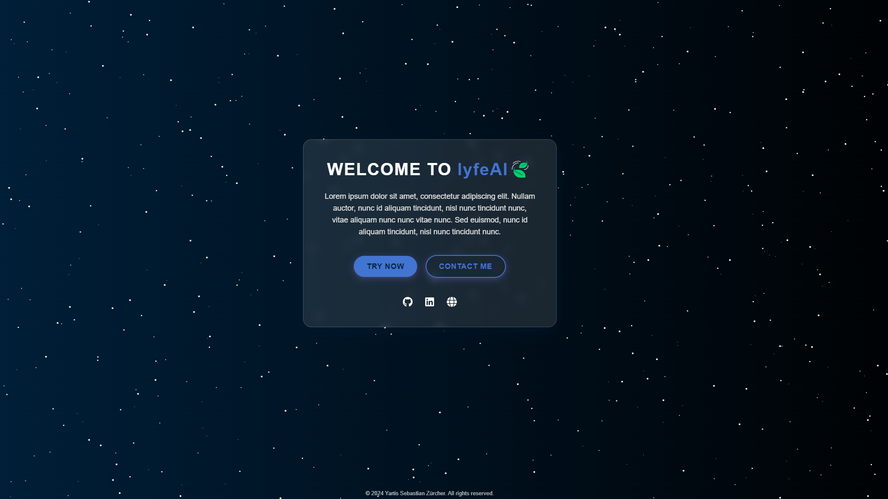
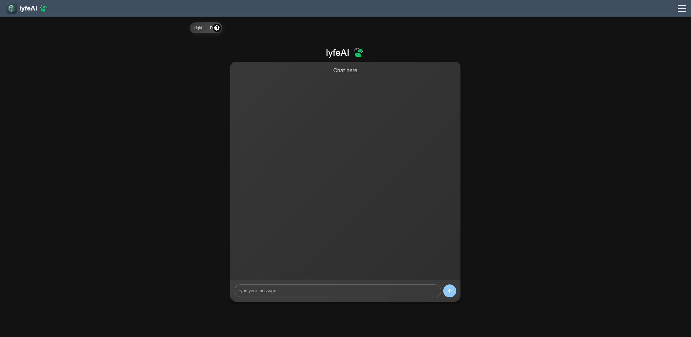

# LyfeAI 🍃

LyfeAI  is your AI-powered assistant designed to make your life easier.

## Features

- **User Authentication**: Register and log in securely.
- **AI Chat**: Interact with an AI-powered chatbot using the OpenAI API.
- **Dark Mode**: Toggle between dark and light themes.
- **Profile Management**: Update your profile and change your password.

## Technologies Used

- **Frontend**:
  - React.js
  - Material-UI
  - Axios
- **Backend**:
  - Spring Boot
  - Hibernate
  - JWT for authentication
  - MySQL
- **Styling**:
  - CSS
  - Styled Components

## Project Structure

### Frontend

- `components`: Contains all React components
- `services`: Axios services for API calls
- `styles`: CSS and styled components

### Backend

- `controller`: REST controllers
- `service`: Business logic
- `repository`: Data access layer
- `model`: Entity classes
- `config`: Security and other configurations

## How to Use

1. **Registration**: Navigate to the registration page and create an account.
2. **Login**: Use your credentials to log in.
3. **Chat**: Start chatting with the AI assistant.
4. **Profile Management**: Update your profile and change your password.
5. **Dark Mode**: Toggle between light and dark themes using the switch in the settings.

## Screenshots

### Welcome Page
  
### Chat
  

## License

This project is licensed under the Proprietary License.

## Contact

For any inquiries, please reach out to me <a href = "https://yanissebastianzuercher.ch/contact" target = "_blank">here</a>.
